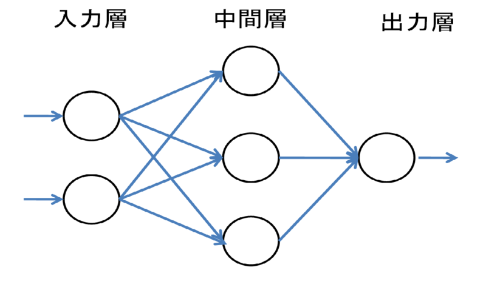

# ニューラルネットワーク
ニューラルネットワークはパーセプトロンのデメリットを解決できる

### パーセプトロンの得意分野
- 複雑な処理を表現できる
- 非線形な表現が可能になる

### パーセプトロンの苦手分野
- 重みの設定は手作業

ニューラルネットワークは適切な重みを自動で学習できるという重要な性質を持つ
本章では概要について説明する
図の左側の列を「入力層」、図の中間の列を「中間層（隠れ層）」、図の右側の列を「出力層」という

