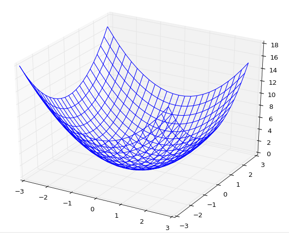
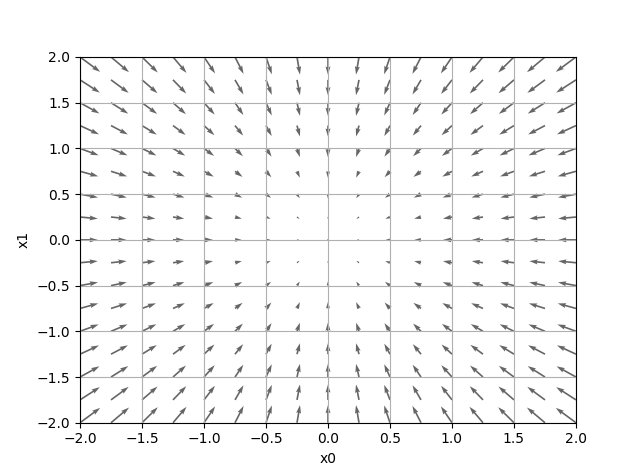

# ニューラルネットワークの学習
訓練データから最適な重みパラメータの値を自動で獲得することを指す

ニューラルネットワークの特徴はデータから学習を行い、重みをそのデータから自動的に決定することができることである

本章で行うことは、ある問題を正しく分類するためのプログラムを自分で設計することではなく、データを有効活用して正しく分類できるようにすることである。その一つの方法として**特徴量**がある。例えば、画像から特徴量を抽出してそのパターンを機械学習の技術で学習することができる。

## 訓練データとテストデータ
機械学習の問題では訓練データとテストデータの2つのデータに分けて学習や実験を行うことが一般的である。

※訓練データは**教師データ**と呼ばれることもある

訓練データとテストデータを分ける理由としては、求めているものが汎化能力（訓練データに含まれないデータ）を正しく評価したいからである。

## 損失関数
ニューラルネットワークの学習には指標として**損失関数**を利用する。損失関数は任意の関数を用いることができるが、一般的には2乗和誤差や交差エントロピー誤差などが用いられます

### 2乗和誤差
損失関数として用いられる最も有名な関数
```
E = (1/2) Σ (yk - tk)^2
```
yk…ニューラルネットワークの出力
tk…教師データ
k…次元数（Σの下につけたかった）

### 交差エントロピー誤差
損失関数として用いられる
```
E = - Σ tk log yk
```
yk…ニューラルネットワークの出力
tk…教師データ
k…次元数（Σの下につけたかった）

### ミニバッチ学習
MNISTのデータは60,000個あるが、すべてのデータに関して損失関数の和を求めるには時間がかかる。
そこで、60.000枚の中から無作為に100枚を選び出し、ミニバッチ（小さな塊）ごとに学習を行う。
このような学習方法を**ミニバッチ学習**と言う

### なぜ損失関数を設定するのか
ニューラルネットワークの学習では最適なパラメータ(重みとバイアス)を探索するときに、損失関数ができるだけ小さな場所を探すようにするために微分を計算して、パラメータを更新していく。
例えば、ニューラルネットワークのある一つの重みに注目し、それの損失関数に対する微分は「重みパラメータの値を少しだけ変化させたときに、損失関数がどのように変化するか」を表している。
もし、微分した値がマイナスになるならば、その重みを正の方向へ変化させることで損失関数を減少させることができる。逆もまたしかりである。

例として、「数字認識」を行うときは認識精度を指標にすればよいではないか！と思えるが、認識精度の微分はほとんどの場所で0になってしまい、その時点でパラメータの更新ができるなくなる。
よって損失関数を設定するのである。

### 偏微分
偏微分の説明を以下の式を参考にみていきます。
```
f(x0, x1) = x0^2 + x1^2
```
この関数をグラフに描画すると次の図のようになる

このような複数の変数からなる関数に対して微分を行うことを**偏微分**という

### 勾配
偏微分を(例えばx0,x1のように)まとめて計算し、それをベクトルとしてまとめたものを勾配(gradient)という。
結果はgradient_2d.pyを実行するとわかりやすい。以下のようになる。

勾配は図のようにベクトルとして表示される。勾配は関数f(x0,x1)の一番低い場所(最小値)を指している。が、実際は必ずしもそうなるわけではなくて、各地点において低くなる方向を指す。
つまり、勾配が指す場所は各地点において**「関数の値を最も減らす方向」**といえる。

### 勾配法
勾配法は現在の場所から勾配方向に向かって一定の距離を進み、移動先でも勾配を求め、また進みの繰り返しで関数の値を徐々に減らしていくものである。
機械学習の最適化問題においてよく使われる手法である。
最小値を探す場合に用いる勾配法を**勾配降下法**という。勾配法は以下の式で表される。
```
x0 = x0 - η * ∂f / ∂x0
x1 = x1 - η * ∂f / ∂x1

```
ηは更新の量を表し、ニューラルネットワークの学習においては**学習率**と呼ばれます。
学習率・・・一回の学習で、どれだけ学習すべきか、どれだけパラメータを更新するかを決める値
学習率は大きすぎても小さすぎてもいけず、適切な値を設定することが重要な問題となる

### 学習アルゴリズムの実装
**前提**
> ニューラルネットワークは重みとバイアスを訓練データに適応するように調整することを
> 「学習」と呼び、以下４つのステップで行う

**ステップ1**
> 訓練データの中からランダムに一部のデータを取り出し（ミニバッチ）、
> ミニバッチの損失関数の値を減らすことを目的とする

**ステップ2**
> ミニバッチの損失関数の値を減らすために、各重みパラメータの勾配を求める
> 勾配は損失関数の値を最も減らす方向を示す

**ステップ3**
> 重みパラメータを勾配方向に微小量だけ更新する

**ステップ4**
> ステップ1〜3を繰り返す

ニューラルネットワークの学習は上の４つのステップの手順に従って行うが、この方法は勾配降下法によってミニバッチを用いてパラメータを更新することから、**確率的勾配降下法**と呼ばれている
