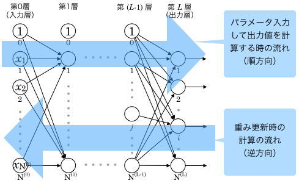

# 誤差逆伝播法
ニューラルネットワークの重みパラメータに関する損失関数の勾配は数値微分によって求めたが、計算には時間がかかるという弱点がある  
第5章では重みパラメータの勾配の計算を効率よく行う「誤差逆伝播法」について学ぶ  
- 以下の図にある通り左から右（出発点から終着点）に向かっての計算を**順伝播**という
- 逆の右側から左側に向かっての計算を**逆伝播**という

### 連鎖率
これまで行ってきた計算は順伝播と同じように左から右側へ計算していた  
一方で逆伝播では「局所的な微分」を右側から左側にしていく。この局所的な微分を伝達する原理は**連鎖率**によるものである  
[連鎖率](https://ja.wikipedia.org/wiki/%E9%80%A3%E9%8E%96%E5%BE%8B)

### 逆伝播
***加算ノードの逆伝播***
加算ノードの逆伝播は入力信号を次のノードへ出力する

***加算ノードの逆伝播***
乗算の逆伝播は入力信号をひっくり返した値を乗算する

### 活性化関数
**ReLU関数**
ReLU関数は順伝播時の入力が0より大きい時は逆伝播は上流の値をそのまま下流に流す  
そうでなければ信号をストップする
ReLU関数の実装はcommon/layer.pyにてクラスを作成している  
ReLUクラスはインスタンス変数としてmask変数をもちTrue,FalseからなるNumpy配列を保持する  
順伝播の入力が0以下ならTrue、そうでなければFalseを保持する  
ReLUレイヤは回路におけるスイッチのような機能をしていて、順伝播時に電流が流れていればスイッチをONにして、そうでなければOFFにする

**sigmoid関数**
シグモイド関数は新しく/とexpが登場する  
「/」ノードは y = 1 / x を表すが、微分をすると- 1 / x^2 となり -y^2 となる  
なので逆伝播のときは上流の値に対して-y^2を乗算して下流へ伝播する  

### 誤差逆伝播法の勾配確認
ここまでは勾配を求めるために数値微分と誤差逆伝播法の2つの方法を説明した  
誤差逆伝播法が正しく実装できれば数値微分は必要ないが、数値微分は一体いつ使えばいいのだろうか？  
数値微分が実践的に必要とされるのは誤差逆伝播法の実装の正しさを確認する時である  
誤差逆伝播法は効率的であるが、実装が複雑でミスが起きやすい。そのため実装の簡単な数値微分の結果を比較して勾配の値が近い値にあることを確認する時に数値微分は使われる 
この確認する作業のことを**勾配確認**という

