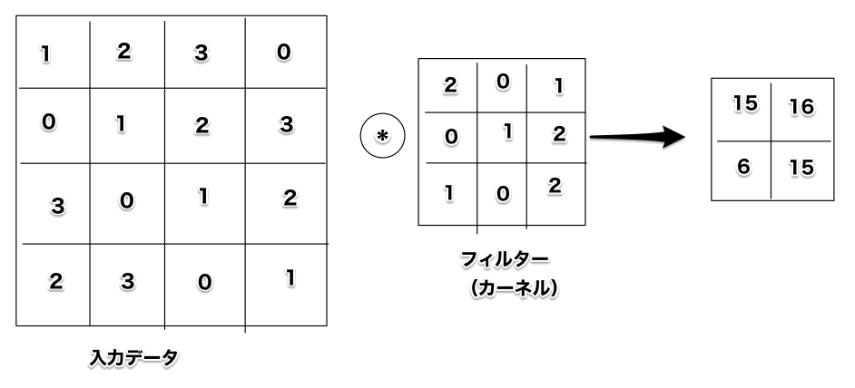
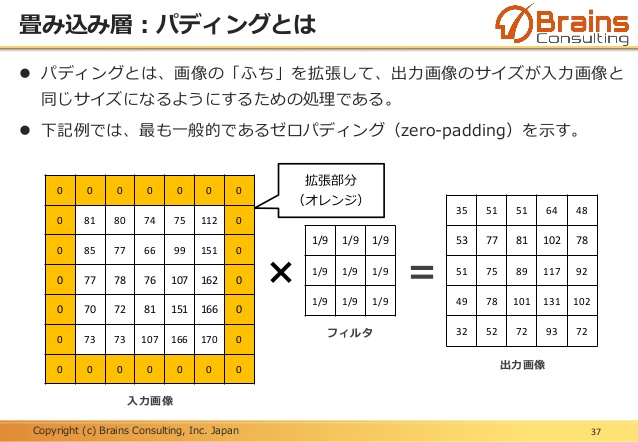
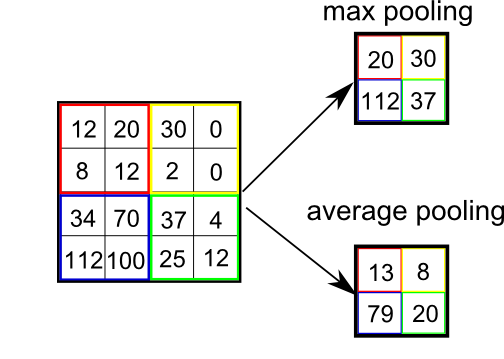
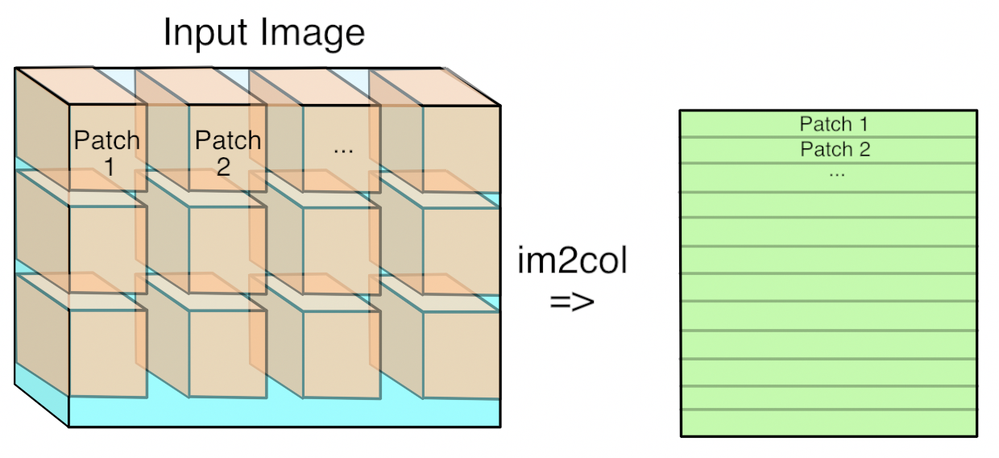

### 畳み込みニューラルネットワーク
畳み込みニューラルネットワーク(CNN…convolutinal neural network)は画像認識や音声認識など、様々なところで用いられている　

### 7.1 概要
CNNはこれまでのニューラルネットワークに加え、「畳み込み層」と「プーリング層」が登場する。　
これまでのニューラルネットワークには隣接する全てのニューロン間で結合があった（全結合）この層をAffineレイヤで実装していた　
全結合のニューラルネットワークはAffineレイヤの後にReLUレイヤが続いていて、最後の層でSoftmaxレイヤで最終的な結果（確率）を出していた  
CNNの場合はConvolutionレイヤの後にReLUレイヤ、Poolingレイヤが続いていて（Poolingレイヤは省略されることがある）、そして出力層に近いところでは、Affineレイヤの後にSoftmaxの組み合わせが用いられている　

### 7.2 畳み込み層
これまで見てきた全結合層の弱点は何だろうか？全結合層のニューラルネットワークは隣接する層のニューロンが結合されていて、出力の数は任意で決めることができた。この全結合層の問題点は、**データの形状を無視**してしまうことである  
通常、画像は３次元データ（縦、横、チャンネル）の形状であるが、全結合層に入力するためには３次元データを平らにする必要があった。３次元データを１列に並べた784個のデータを最初のAffineレイヤに入力していた　
一方で、CNNは画像の場合には３次元データをそのまま受け取り、３次元データとして次の層に出力するので、形状を有したデータを正しく理解できる可能性がある　
※CNNは畳み込み層の入出力データを、**特徴マップ**、入力データを**入力特徴マップ**、出力データを**出力特徴マップ**という  

畳み込み層で行う処理は「**畳み込み演算**」です。

画像の入力データの左上の3x3とフィルターを乗算して和を求める　
これを右上、左下、右下の3x3においても同様に計算して2x2の出力を得る  
このフィルターは全結合のニューラルネットワークにおける重みに対応する　
この2x2の重みに対してバイアス（1x1）を加算して出力データを得る　

畳み込み層の処理前に、入力データの周囲を固定データで囲うことがある。これを**パディング**という　

フィルターを適用する位置の間隔を**ストライド**という上の例では全てストライドは１だったが、ストライドを2にすると、左上から次の計算を行う時に２つ右に移動して計算を行う　
ストライドは大きくすると出力サイズが小さくなる　

３次元データで畳み込み演算をする時にはこれまでに比べ奥行きの方向に特徴マップが増える。チャンネル毎に入力データとフィルターの畳み込み演算を行い、それぞれの結果を加算してひとつの出力を得る。　
ここで注意する点は入力データとフィルターのチャンネル数は同じにすることである　

### 7.3 プーリング層
プーリングは、縦・横方向の空間を小さくする演算です　
プーリングには最大値をとるMaxプーリングと、平均を取るAverageプーリングがある  

プーリング層の特徴は
1. 学習するパラメータがない　
プーリング層は畳み込み層と違い学習するパラメータを持たない　
プーリングは対象領域から最大値（平均）を取るだけの処理のため　
1. チャンネル数は変化しない　
プーリングの演算はチャンネル毎に独立して計算が行われるためにチャンネルの数は変化しない　
1. 微小な位置変化に対して頑健（ロバスト）　
同じような入力データで、少しデータがズレていたところでそのズレはプーリングは吸収する　
※但し、必ず結果が一致するわけではない　

### 7.4  Convolution/Poolingレイヤの実装
CNNでは４次元配列を扱うために複雑になりそうな予感がするがim2colというものを使うと簡単に実装することができる　
ちなみに各層を流れるデータの形状は(10, 2, 28, 28)のようになっていて、これは高さ28、横幅28、１チャンネルのデータが10個あるということを示す　
im2colは以下のようにして、３次元データを２次元データに変換する  

### 7.7 代表的なCNN

1. LeNet
手書き数字認識を行うネットワークとして提案された　
畳み込み層とプーリング層を連続して行い（サブサンプリング）、最後に全結合を経て結果が出力される　
現在のCNNとLeNetを比較するといくつか違いがある　
- LeNetはシグモイド関数を使うが、現在のCNNではReLUが使われる
- LeNetではサブサンプリングによって中間データのサイズ縮小を行なっているが、現在ではMaxプーリングが主流となっている

1. AlexNet
ネットワーク構成はLeNetと大きく変わっていないが以下の点で異なる
- 活性化関数にReLUを用いる
- LRN(Local Response Normalization)という局所的正規化を行う層を用いる
- Dropoutを使用する(6章Dropout参照)

